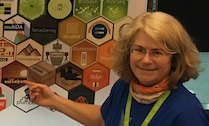
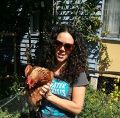
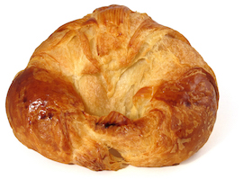
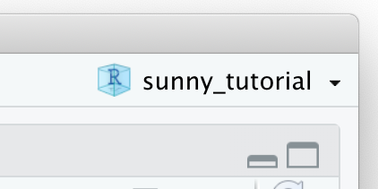
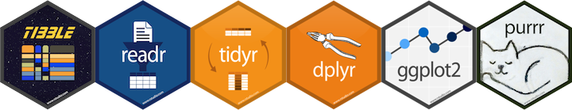

```{r setup, include=FALSE}
library(learnr)
knitr::opts_chunk$set(echo = FALSE,
                      message = FALSE,
                      warning = FALSE,
                      error = FALSE, 
                      comment="")
tutorial_html_dependency()
```

```{r}
library(emo)
library(anicon)
```

## Welcome!

**Hi boffins! Welcome to the coding with R class!** Let me introduce you to our team:

<table>
<tr>
<td width=350 height=300>  </td> <td width=20> </td> <td> Hi, I'm Di! A professor at Monash University in Melbourne Australia, and I like reading, and to play all sorts of sports, tennis, soccer, hockey, cricket, and go boogie boarding.
</td> </tr>
<tr>

<tr>
<td width=350> </td> <td width=20> </td> <td>This is Jessie! I help people from industry solve problems with maths. I like hiking, camping, gardening and playing music.
</td> </tr>

<tr>
<td width=350> </td> <td width=20> </td> <td> 
This is Steff! I am doing a Masters Degree at QUT, and I work with Di at Monash in Melbourne. I love reading, drinking chai lattes and eating croissants.
</td> </tr>
<tr>
<td width=350>  </td> <td width=20> </td> <td>
This is Amy! I am about to start a research masters in mathematics at the Queensland University of Technology. I aim to improve the MRI contrast between brain tissue and tumour tissue in mice using new and exciting mathematics. In my spare time I like to rock climb, read books and make geometric drawings. 
</td> </tr>
<tr>
<td width=350>  </td> <td width=20> </td> <td> This is Grace! I study a dual degree of Mathematics and Electrical Engineering at QUT. I love coffee, plants and board games.
</td> </tr>
<tr>
<td width=350>  </td> <td width=20> </td> <td> This is Ella! I am a 4th year maths and engineering student at QUT. In my spare time I play video games, paint, and collect plants. 
</td> </tr>
</table>


### CODE of CONDUCT:

1. Be positive
2. Be inclusive
3. Ask for help, and give some help

### Exercise 

`r emo::ji("family")`
*We are going to make teams of 2-3 people for the day.* 

`r emo::ji("wave")` *Introduce yourself to the other members of your team, and brainstorm a team name.* A few icebreakers: "What's your favorite colour?", "What's your favorite animal or plant or insect?", "Do you have a favorite game?", "movie?", "book?", "When and where did you go for your last or favorite holiday?"

`r emo::ji("user")` 
*Tell us about your choice of team name, and introduce us to each team member*

## How's the day planned

- There will be a little bit of instruction, and a few exercises, then some more instruction, and some more exercises, some reading, some more exercises, ...
- The goal for the day is to work with your team and mentor to make a web app for looking at data.
- We are going to learn about the software R, and the language of data analysis. There's a lot of things to learn. Its ok if you can't remember it all. Most important thing is to have fun and play, break things and fix them, try out new stuff!
- We will have breaks whenever you feel you want them - there are goodies for morning, afternoon tea, and lunch.


MATERIALS for WORKSHOP:

*These notes can be found at https://ebsmonash.shinyapps.io/sunny_tutorial/ * and example web apps can be found at https://ebsmonash.shinyapps.io/pisa/ and https://ebsmonash.shinyapps.io/pisa_world/. 

## Let's get started learning R! 

- *Login to your computer.* 
- *Open RStudio, using `Start -> All Programs`*
- *Create a project for your work. On the very right side of the window is a small blue R, and a drop-down menu. Select `New project`, then `New directory`, navigate to the desktop, and name the project `sunny`. This will create a folder with this name on the desktop. This will be our workspace for the day.*

```{r fig.height = 6, fig.width = 8, fig.align='center'}

```

## What is R!

The R project is a huge open source software collaboration. There is a foundation team of 36 people, and contributions from thousands of people globally. You can learn more about the project by visiting this web site [https://www.r-project.org](https://www.r-project.org).

R is the language of data analysis! It is the top program used for data science today, one of the most powerful tools available, and completely free for anyone to use. 

RStudio is commercial product, but it is free to most of us, and it provides an interface to help us use the R language. 

*If R is the airplane, RStudio is the airport terminal that provides the support.*

## Start coding!

The RStudio window has mutiple panes.

- *Console*: you can type R commands and see output
- *Help*: find out information about functions and packages. This same panel will have tabs for *showing plots* that you make, *view apps* and documents, show *files* in the folder, and *packages* used. 
- *Environment*: lists the objects that you create, such as data sets.
- *Editor*: for creating scripts to run in pieces or as a whole (like this document!)

R is a scripting language, which means that it is just like writing an essay, or a math proof. We write a script to do specific tasks, that we can run again and again, or give to someone else to run. 

*Write the R code required to add two plus two (yes, it is as simple as typing `2+2` below:*

```{r two-plus-two, exercise=TRUE}

```

*R is like a big calculator! Try doing other math operations, like subtraction, multiplication, division, or square root and power operations.*

## Quiz

```{r operators}
quiz(
  question("Which symbol/operator is used to indicate raising a number to a power?",
    answer("`+`"),
    answer("`/`"),
    answer("`^`", correct = TRUE),
    answer("`%`")
  ),
  question("If you want to find the remainder of 5 divided by 2, which operator is used?",
    answer("`%%`", correct = TRUE),
    answer("`%/%`"),
    answer("`|`"),
    answer("`*`")
    )
)
```

## Language

Really important parts to the language!

1. **gets** operator `<-`:  This is just like an `=` sign. Allows you to save a data, or model, object.
2.  the **pipe**, `%>%`: you can string several operations together, its like *do this* "and" *then do* 
3. Functions have `(...)` you need to have some *inputs* and expect something to be *output*
4. Subsets of data have `[a,b]` so that you can specify row `a`, and column `b`
5. Lines starting with `#` are comments, helps tell the person looking at your code, or remind you, what the code is trying to do

### Other useful details

- Packages are installed once, using the function `install.packages()` and loaded each session when you want to use them with the function `library()`
- Get help on any function using `?` or `help()`

## Simulation

Let's pretend that we are math teachers and we've just given the class a test. R can be used to simulate results like this. 

- The code `rnorm(n = 35, mean = 70, sd = 10)` will generate a sample of size 35 from a normal model with mean 70 and standard deviation 10. 
- But when you do this you will likely want to save the result into a data object. Lets call this `scores`. 
- To save it you need to assign the result to `scores` using the `gets` operator `<-`. This is just like an `=` sign. 

*Try it, `scores <- rnorm(n = 35, mean = 70, sd = 10)`*

```{r rnorm, exercise=TRUE}

```

Oh, nothing happens! That is because we have saved the result into a data object. Let's check if we have created a dataset. You can check the length of scores using `length(scores)`. It should be 35. You can also compute the mean and standard deviation of the data using `mean(scores)` and `sd(scores)`

## Functions

- In math, we use functions all the time. Functions have inputs and outputs, e.g. $f(x) = 3x^2+x+1$. 
- In coding, functions allow us to "not repeat ourself". If we have a task that we want to do many times, with just some parameter changes, then coding the task as a function, with inputs and expected outputs, means shorter, more readable code.
- R can be considered to be a functional language. These are functions that we have just used, `rnorm(), mean(), sd()`. 

What does a function in R look like? The polynomial function above would look like this in R:

```
mypolyfn <- function(x) {
  f <- 3*x^2 + x + 1
  return(f)
}
```

It takes `x` as the input, and returns `f` as output. The benefit of functions is that it makes your work more efficient - anything that you need to do again and again, or on different sets of data, should be programmed into a function.

*Try it!* Write the function below, so that it is defined. And then test it out by inputting different values of `x`, e.g. `mypolyfn(2)`, or `mypolyfn(-1)`, or even entering a vector of `x`'s, `mypolyfn(seq(-5, 5, 1))`

```{r functions, exercise=TRUE}

```

What can go wrong?

This function is expecting `x` to be a number. If the user inputs something other that a number, what happens? 

*Try it!* Try running your function with a text string of your team name instead of a number, e.g. `mypolyfn("numbat")`.

You get an error. Well-written functions check for silly user errors. A better version of the function would be:

```
mypolyfn <- function(x) {
  stopifnot(is.numeric(x))
  f <- 3*x^2 + x + 1
  return(f)
}
```

## YOUR TURN

With your team, experiment with writing functions, in your RStudio Window. Try to write a function that simulates a sample of size $n$ from a normal model, allowing the user to input the population mean and standard deviation. The return values from the function should be the mean and standard deviation of the sample.

## Data frames, tibbles, matrices, vectors

```{r fig.align='center'}

```

The strength of R is the contribution from people globally, in the form of packages. One of the most used suite of packages is called the `tidyverse`. It has many really easy to use, and nicely contructed functions for reading data, organising data into a format that can be plotted, modelled and analysed. 

To use a package you load the library:

```
library(tidyverse)
```

If you get an error when you load a library, then your version of R on your computer doesn't yet have that package. So you would need to install it using `install.packages("tidyverse")`. You would install once, but load the library every time you start R when you want to use it. WE DON'T NEED TO INSTALL ANY PACKAGES TODAY, EVERYTHING HAS BEEN PRE-INSTALLED. 

Let's take a look at the `tidyverse` package. (It has these packages, `ggplot2`, `tibble`, `tidyr`, `readr`, `purrr`, `dplyr` that will be all loaded when `tidyverse` is loaded.) Load the `tidyverse` library:

```{r echo=TRUE}
library(tidyverse)
data(diamonds)
diamonds
```

The diamonds data is one of the data sets provided with the tidyverse to help you learn R. It contains measurements on 50000 diamonds, from a large database of sales. There are 10 variables. Look at the top of overview of the data provided, and you will see the variable labels, and a short-hand description of the type of variable is in the column: `dbl` means numeric, high precision; `ord` is an ordered categorical variable; `int` is a numeric that takes only integer values. Other possible types include `chr` is a text or categorical variable, `fctr` a special type of categorical variable with levels, `date` contains a date, and `lgl` means logical (`TRUE` or `FALSE`). 

## Quiz

Look at the data summary and answer these questions:

```{r datatypes}
quiz(
  question("What type of variable is carat?",
    answer("dbl", correct = TRUE),
    answer("int"),
    answer("ord"),
    answer("chr")
  ),
  question("What type of variable is cut?",
    answer("dbl"),
    answer("int"),
    answer("ord", correct = TRUE),
    answer("chr")
    ),
  question("What type of variable is price?",
    answer("dbl"),
    answer("int", correct = TRUE),
    answer("ord"),
    answer("chr")
    )
)
```

## Back to tibbles and matrices

The whole data set, diamonds is what the tidyverse calls a `tibble`. Tibble is a play on the word table! But it means data in a rectangular format, where there may be different types of variables (numeric, categorical, dates, ...) in different columns. A tibble is a special case of a `data.frame`. You can check the type of data object with a query:

```{r echo=TRUE}
is_tibble(diamonds)
is.data.frame(diamonds)
is.matrix(diamonds)
```

*Aside: The tidyverse tends to use `_` in its function names. Older parts of R tend to use `.` to separate words in function names.*

So diamonds is a tibble and a data.frame, but it is not a matrix. 

When you simulated the sample from a normal model, 

```{r echo=TRUE}
x <- rnorm(100)
is_tibble(x)
is.data.frame(x)
is.matrix(x)
is.vector(x)
```

you created a `vector`. A vector is a column of numbers, and a `matrix` is a rectangular format of data, like a tibble, it has variables in columns, but it can only contain numeric values. 

Knowing the data type, is important because some functions expect one sort of data and can throw an error if it gets something different. You can convert data objects between types. 

A good resource on learning more about the `tidyverse` is the book "R for Data Science" by Garret Grolemund and Hadley Wickham. [You can read it free online.](http://r4ds.had.co.nz/)

## YOUR TURN: Tidy data verbs

With your group read sections 12.1-12.3 of [R for Data Science](http://r4ds.had.co.nz/tidy-data.html). Then answer these questions:

```{r tidydata}
quiz(
  question("What the three interrelated rules which make a dataset tidy?",
    answer("Each variable must have its own column.", correct = TRUE),
    answer("Each observation must have its own row.", correct = TRUE),
    answer("Each value must have its own cell.", correct = TRUE),
    answer("None of these")
  ),
  question("A common problem is a dataset where some of the column names are not names of variables, but values of a variable. What verb does an action which organises those columns into a new pair of variables?",
    answer("gather", correct = TRUE),
    answer("spread"),
    answer("mutate"),
    answer("select")
    ),
  question("What verb does the opposite to gather?",
    answer("gather"),
    answer("spread", correct = TRUE),
    answer("mutate"),
    answer("select")
    ) 
)
```

## Wrangling verbs

The vast majority of data cleaning tasks can be handled with five verbs:

- `filter()` Pick observations by their values.
- `arrange()` Reorder the rows.
- `select()` Pick variables by their names.
- `mutate()` Create new variables with functions of existing variables.
- `summarise()` Collapse many values down to a single summary.

Oh, and if you use the pipe, `%>%`, you can string several of these actions together to make a data pipeline.

You can find a data wrangling cheatsheet [here](https://github.com/rstudio/cheatsheets/blob/master/data-transformation.pdf).

## Filter

Filter is used to pick some cases or observations in the data. Here's an example for the diamonds data. We will choose just diamonds with a `Fair` cut. And to save printing all this to screen, we will check how many diamonds fall into this group.

```{r echo=TRUE}
diamonds %>% filter(cut == "Fair") %>% tally()
```

*Try it!* Do these exercises:

- Filter the diamonds data to pick only diamonds that cost less than $400
- Filter diamonds with a Fair cut and cost less than $400
- Filter the diamonds that have cut "Fair" or "Good" (HINT: You need to use the operator `%in%` like this `%in% c("Fair","Good"))`

```{r filter, exercise=TRUE}

```

## Select

Select is used to pick some variables in the data. Here's an example for the diamonds data. We will select just the variables carat and price, thinking that we might make a model for price built on the size of the diamond.

```{r echo=TRUE}
diamonds %>% select(carat, price) 
```

*Try it!* Select the variables `x`, `y`, `z`


```{r select, exercise=TRUE}

```

## Arrange

Arrange sorts the data by values in one of the columns. Here's an example which also involves selecting a subset of variables.


```{r echo=TRUE}
diamonds %>% select(carat, price) %>%
  arrange(desc(price))
```

Note that `desc` arranges in descending order. 

*Try it!* Arrange carat by price, in increasing order.


```{r arrange, exercise=TRUE}

```

Arrange is mostly used to get quick views of the numbers.

## Mutate

I love the name mutate! It means to create new variables, or modify existing ones. For the diamonds, we might be interested in examining the price per carat of a diamond. Here's how we can create this variable:

```{r echo=TRUE}
diamonds %>% mutate(ppc = price/carat)
```

*Try it!* Compute a new variable called size, based on a volume as measured by `x`, `y`, `z`. Is it the same or different from carat?


```{r mutate, exercise=TRUE}

```

## Summarise

Summarise is the workhorse function. It takes columns of the data, and reduces them to single numbers. It most useful when we want to compute statistics for subsets of the data.  For the diamonds, we might be interested in computing the mean and standard deviation price of price. 

```{r echo=TRUE}
diamonds %>% summarise(m=mean(price, na.rm=TRUE), 
                       s=sd(price, na.rm=TRUE))
```

Price might be dependent on the color of the diamond, so we can compute this separately for each of the color categories. Which  color is the most expensive?

```{r echo=TRUE}
diamonds %>% group_by(color) %>%
  summarise(m=mean(price, na.rm=TRUE), 
                       s=sd(price, na.rm=TRUE))
```

*Try it!* Compute the mean and standard deviation for (a) the cut, (b) clarity of diamond.

```{r summarise, exercise=TRUE}

```

## Grammar of graphics

The grammar of graphics is a language that maps variables into graphical elements. Instead of uniquely naming specialist plots, like barchart, pie chart, histogram ... it provides the description of a plot, that enables comparing how they are similar and different. It gives us a more formal, and yes, mathematical way to make data plots. 
The grammar of graphics has these major elements:

```
ggplot(data = <DATA>) + 
  <GEOM_FUNCTION>(
     mapping = aes(<MAPPINGS>),
     stat = <STAT>, 
     position = <POSITION>
  ) +
  <COORDINATE_FUNCTION> +
  <FACET_FUNCTION>
```
  
- DATA: This is the data.frame or tibble that you are starting from
- MAPPINGS: Specific details of how a variable is mapped into the plot
- GEOM: The graphical element to use, e.g. point, line, rectangle, density, boxplot, ...
- STAT: A statistical calculation, if necessary, e.g. bin to make a histogram or barchart.
- POSITION: Some types of plots, like barcharts conventionally have small deviations in design, like stacked, side-by-side, 100%. Position enables this type of shift.
- COORDINATE: Most commonly we are using cartesian coordinates, but some plots benefit by putting them in polar coordinates, or even in a special map ratio, or some variables shown on a log scale.
- FACET: Split the data into subsets and plot separately. Good for making comparisons across groups. 

Here are some examples. We will use with a smaller subset of the diamonds for efficiency.

```{r echo=TRUE}
diamonds_small <- diamonds %>% sample_n(1000)
ggplot(diamonds_small) +
  geom_point(aes(x=carat, y=price))
```

This is a scatterplot of price by carat. There is a hint in the plot that carat tends to fall along some standard values, e.g. 1, 1.5, ... There are more small diamonds than larger ones - we would describe carat as right-skewed. Price is also right-skewed, as there are many more low prices diamonds than expensive ones. 

```{r echo=TRUE}
ggplot(diamonds_small) +
  geom_bar(aes(x=cut))
```

This is a barchart of cut of the diamond. We can see that most diamonds have an "Ideal" cut, and there are very few "Fair" cut diamonds.

```{r echo=TRUE}
ggplot(diamonds_small) +
  geom_point(aes(x=carat, y=price, colour=cut))
```

This is a scatterplot of price by carat, where points are coloured by the cut of the diamond. It is hard to see much difference in price between the cuts, there's a lot of overlap. It can be helpful to focus the view to display a model fit, instead of (or with) the points. 

```{r echo=TRUE}
ggplot(diamonds_small) +
  geom_smooth(aes(x=carat, y=price, colour=cut), se=FALSE)
```

There's really not much difference, at least for this subset. Maybe the Ideal cut has very slightly higher relative price.

Let's now look at two categorical variables. We examine cut and clarity. (Note that with a barchart, we need to use `fill` rather than `colour` to paint in the bars.)

```{r echo=TRUE}
ggplot(diamonds_small) +
  geom_bar(aes(x=cut, fill=clarity))
```

To examine the association between two categorical variables, it can be better to focus on proportions, rather than counts. The counts in the different cut categories are very different, and its hard to be able to say that the proportion of the clarity categories are the same or different in each bar. Here's where position helps:

```{r echo=TRUE}
ggplot(diamonds_small) +
  geom_bar(aes(x=cut, fill=clarity), position="fill")
```

Now we can see that there are differences in the clarity for different cuts. The Ideal cut tends not to have I1 clarity diamonds, and the Fair cut diamonds tend not to have any IF clarity diamonds. 

*Try it!* Change the position to be `dodge`, and see what type of plot is created.

```{r dodge, exercise=TRUE}

```

Its also possible to make separate plots for each of the clarity categories, using facet:

```{r echo=TRUE}
ggplot(diamonds_small) +
  geom_bar(aes(x=cut, fill=clarity)) +
  facet_wrap(~clarity, ncol=4, scales="free_x") +
  coord_flip() + theme(legend.position="bottom")
```

Now we can see the the distribution of cuts is different in the l1 and SI2 clarity categories, but fairly similar in the others. The IF clarity group is almost exclusively Ideal cut. 

When you have a categorical variable, and a quantitative variable, a good type of display is the side-by-side boxplot. Let's look at price by cut.

```{r echo=TRUE}
ggplot(diamonds_small) +
  geom_boxplot(aes(x=cut, y=price, fill=cut))
```

We can see that the Fair cut diamonds tend to be slightly more expensive. 

```{r boxplot}
quiz(
  question("In a boxplot what does the line in the middle of the box represent?",
    answer("median", correct = TRUE),
    answer("mean"),
    answer("standard deviation"),
    answer("Interquartile range")
  ),
  question("In a boxplot what does the box represent?",
    answer("median"),
    answer("mean"),
    answer("standard deviation"),
    answer("interquartile range", correct = TRUE)
  )
)
```

*Try it!* Examine the side-by-side boxplot of price by clarity. Is there a difference in price across the different clarity groups? Also try out `geom_violin` instead of `geom_boxplot`. What does this do? 

```{r violin, exercise=TRUE}

```

There is a chapter on visualisation in [R for Data Science](http://r4ds.had.co.nz/data-visualisation.html) with lots of examples. If you have time, take a skim through this and try out some of the ideas. There is also a [graphics cheatsheet](https://www.rstudio.com/wp-content/uploads/2016/11/ggplot2-cheatsheet-2.1.pdf) that can be useful to learn about all sorts of geoms, options, transformations, themes, ...

## Atlas of Living Australia data

The [Atlas of Living Australia](https://www.ala.org.au) is an amazing resource storing information about biodiversity in Australia. 

### Your turn

Point your browser to the ALA web site, and fund the answers to these questions:

```{r ala}
quiz(
  question("Approximately, how many species are recorded being sighted in ALA?",
    answer("1,250"),
    answer("12,500"),
    answer("125,000", correct = TRUE),
    answer("12,500,000")
  ),
  question("What organisation hosts ALA?",
    answer("QUT"),
    answer("foRwards"),
    answer("NCRIS"),
    answer("CSIRO", correct = TRUE)
  ),
  question("What type of license is the data released under?",
    answer("Creative Commons Attribution 3.0 Australia License", correct = TRUE),
    answer("Copyright 2019 The Royal Society"),
    answer("CSIRO Publishing license"),
    answer("None"))
)
```

### Downloading data

You can download data in a number of ways. From the web site you can 
- get full data sets, e.g. fish or plant or birds, ..., which are in `csv` format, and some are huge
- extract all the records for a selection of organisms
- locate an area on a map, or provide your geographic coordinates and get all the sightings within a X km radius
- use the R package `ALA4R` to dynamically extract subsets of taxa, dates or locations

For this workshop, I downloaded data from the web site. I entered the latitude and longitude for Brisbane, and selected all records of sightings within 5km. The full data set created has a web reference https://doi.org/10.26197/5c9bf33ad066e. 

I then cleaned the data, a lot! 

- Records dated back to 1600s. Not believable! I only kept the records of sightings since 2000.
- If the record was missing on Kingdom, Year, Month, Day it was removed
- Some `Vernacular name`'s were mising, but their `Scientific Name` was present, and they were abundantly sighted, so I googled the common name and filled in the missing, e.g "Spangled Drongo"
- Only the common species that had been sighted at least 100 times were kept. The resulting subset of data has 77 common species to explore - that's still a lot!
  
```{r eval=FALSE}
library(tidyverse)
library(ggmap)
brissy_map <- get_map(location=c(153.0251, -27.4698), zoom=13)
ggmap(brissy_map)
ala <- read_csv("records-2019-03-28/records-2019-03-28.csv")
ggmap(brissy_map) + geom_point(data=ala, aes(x=Longitude, y=Latitude))
ala_sub <- ala %>% select(`Record ID`, `Scientific Name`, `Vernacular name`, Kingdom, Phylum, Class, Order, Family, Genus, Species, Latitude, Longitude, Collector, Year, Month, Day)
write_csv(ala_sub, "brissy_ala.csv")
ala <- read_csv("brissy_ala.csv")
ala <- ala %>% filter(!is.na(Kingdom))
ala <- ala %>% filter(!is.na(Year))
write_csv(ala, "brissy_ala.csv")
# Citation URL: https://doi.org/10.26197/5c9bf33ad066e

# More cleaning
ala <- ala %>% mutate(`Vernacular name` = ifelse(`Scientific Name`=="Corvus orru orru", "Torresian crow", `Vernacular name`))
ala <- ala %>% mutate(`Vernacular name` = ifelse(`Scientific Name`=="Sphecotheres vieilloti vieilloti", "Australasian figbird", `Vernacular name`))
ala <- ala %>% mutate(`Vernacular name` = ifelse(`Scientific Name`=="Gallinula (Gallinula) tenebrosa tenebrosa", "Dusky moorhen", `Vernacular name`))
ala <- ala %>% mutate(`Vernacular name` = ifelse(`Scientific Name`=="Rhipidura (Rhipidura) albiscapa albiscapa", "Spangled drongo", `Vernacular name`))
ala <- ala %>% mutate(`Vernacular name` = ifelse(`Scientific Name`=="Dicrurus bracteatus bracteatus", "Grey fantail", `Vernacular name`))
ala <- ala %>% mutate(`Vernacular name` = ifelse(`Scientific Name`=="Malurus (Leggeornis) lamberti lamberti", "Variegated Fairy-Wren", `Vernacular name`))
ala <- ala %>% mutate(`Vernacular name` = ifelse(`Scientific Name`=="Gerygone levigaster levigaster", "Mangrove gerygone", `Vernacular name`))
ala <- ala %>% filter(Year>1999)
ala <- ala %>% filter(!is.na(Month))
ala <- ala %>% filter(!is.na(Day))
ala <- ala %>% filter(!is.na(`Vernacular name`))
keep <- ala %>% count(`Vernacular name`) %>% filter(n>100)
ala <- ala %>% filter(`Vernacular name` %in% keep$`Vernacular name`)
```


### Reading in the data

The data is stored in a `csv` format file called `brissy_ala.csv`. You can read it in with the `read_csv()` function from the `readr` package.

```{r echo=TRUE}
library(tidyverse)
ala <- read_csv("brissy_ala.csv")
```

It would be good to have map.

```{r echo=TRUE}
library(ggmap)
load("brissy_map.rda")
```


### Making a map

```{r}
library(ggthemes)
ggmap(brissy_map) + 
  geom_point(data=ala, aes(x=Longitude, y=Latitude, colour=Kingdom), alpha=0.5) +
  scale_colour_brewer(palette="Dark2") +
  theme_map(base_size = 7)
```

### Animals

```{r}
ala %>% filter(Kingdom == "Animalia") %>% count(`Scientific Name`, sort=TRUE)
ala %>% filter(`Scientific Name` == "Manorina (Myzantha) melanocephala") %>%
  select(`Vernacular name`) %>% distinct()
```

### Brush turkeys

- What's the scientific name for a brush turkey?
- Where are they located?
- Have the numebrs changed over time?

## Building a web story 


## Goal for the day

*The task for the rest of the day is to build an app, using the basic one that is provided. Add more features, change the plots, add more data, ... the choice is up to you. Come up with something that you think your friends, teachers or parents might like to explore about animals and plants that live around Brisbane.*

The code and data can be downloaded from 

At the end of the day, we will have presentations from each group about your app. 

<a rel="license" href="http://creativecommons.org/licenses/by-sa/4.0/"></a><br />This work is licensed under a <a rel="license" href="http://creativecommons.org/licenses/by-sa/4.0/">Creative Commons Attribution-ShareAlike 4.0 International License</a>.
